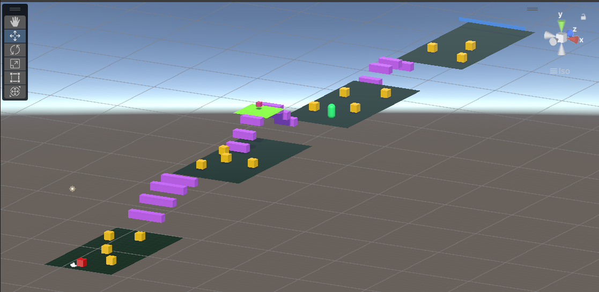
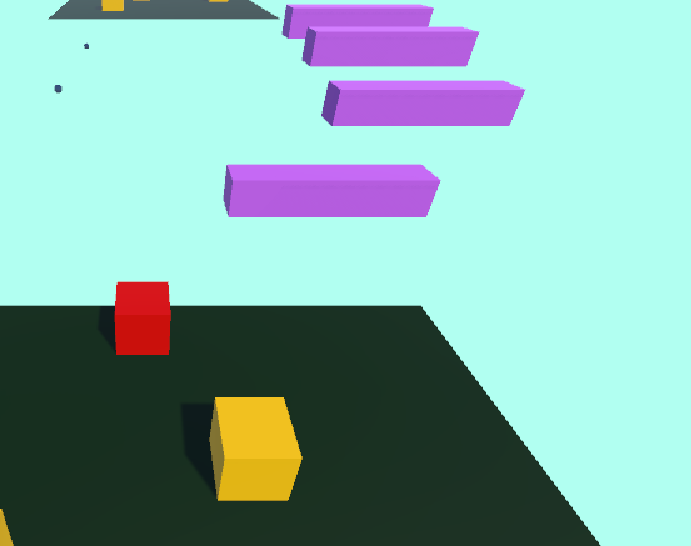
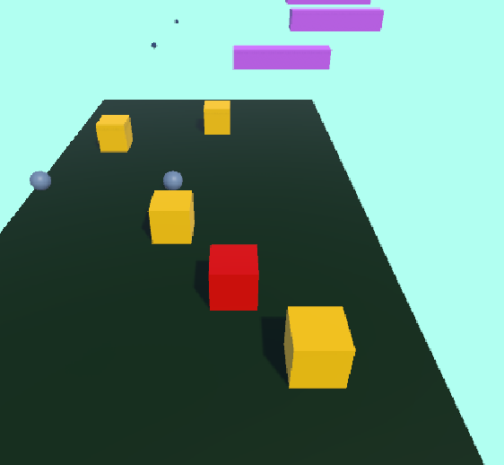
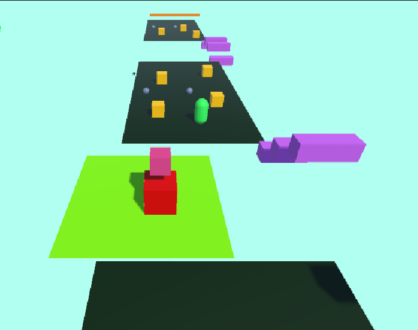
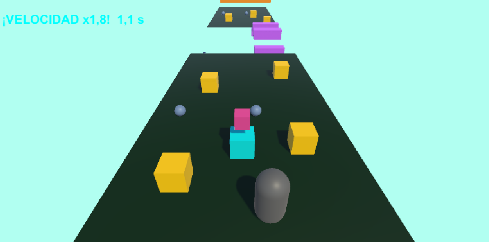
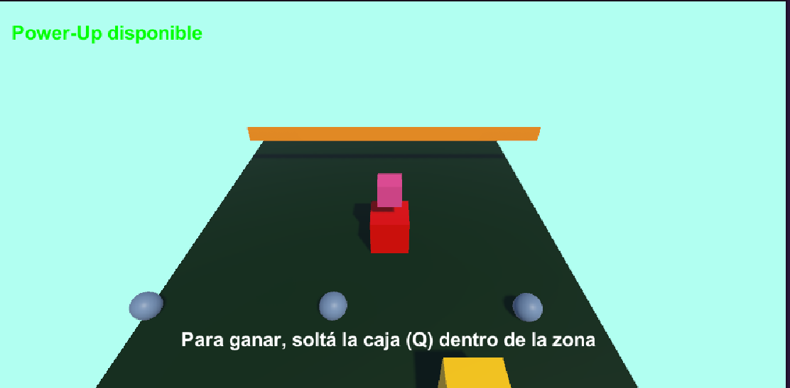
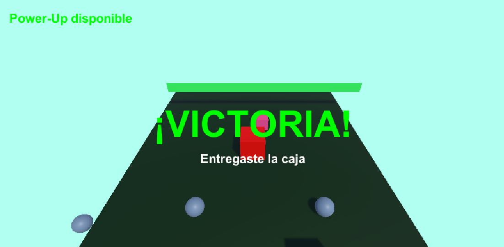

# TP1_Prg1 · Entrega de la caja

Prototipo 3D desarrollado en Unity para el **Trabajo Práctico Nº 1** de *Programación de Videojuegos I* (TUDIVJ, Facultad de Ingeniería, UNJu).

**Autora:** Esmeralda González Tolay



## Descripción del juego

Controlás un personaje que recorre un escenario con plataformas, obstáculos y una plataforma móvil. El objetivo es **recoger una caja, transportarla hasta la zona de meta y soltarla dentro de ella**. Mientras avanzás, un generador lanza esferas que, si te tocan, te devuelven al inicio (y la caja vuelve a su lugar). En el camino hay un potenciador de velocidad temporal.

La victoria se activa **solo si la caja es depositada en la zona de entrega**: no alcanza con que entre el personaje.

## Versión de Unity

**2022.3.31f1**

## Controles

| Tecla | Acción |
|---|---|
| **W A S D** | Mover al personaje |
| **Espacio** | Saltar |
| **E** | Recoger la caja (a menos de 2 unidades) |
| **Q** | Soltar la caja |

## Mecánicas implementadas

| Consigna | Mecánica | Scripts |
|---|---|---|
| 1 | Escenario jugable, personaje con Rigidbody, cámara que lo sigue (esquiva obstáculos) | `PlayerMovement`, `IMovementStrategy`, `CameraFollow` |
| 2 | Plataforma móvil entre dos puntos; la pausa y el cambio de dirección se temporizan con `Invoke()` | `MovingPlatform` |
| 3 | Spawner que instancia un prefab de obstáculo con `InvokeRepeating()`; los obstáculos se eliminan con `Destroy` para no acumularse | `Spawner`, `Obstacle` |
| 4 | Recolección y transporte de la caja con `SetParent()`; al soltarla recupera su independencia y su física | `PickableBox`, `PlayerInteraction` |
| 5 | Power-Up temporal con corrutina: duración del efecto y período de recarga | `PowerUp` |
| 6 | Zona de entrega con Collider Trigger que verifica que lo depositado sea la caja; mensaje y cambio de color de victoria | `DeliveryZone` |

### Detalles de cada mecánica

- **Movimiento:** patrón *Strategy* (`SmoothMovement` y `AccelerateMovement`). El personaje se mueve con `Rigidbody` en los ejes X y Z, con salto.
- **Plataforma móvil:** al llegar a un extremo se detiene y `Invoke()` invierte la dirección tras 2 segundos. Arrastra al personaje mientras está encima.
- **Spawner:** genera una esfera cada 2 segundos y la lanza; cada instancia se destruye a los 6 segundos.
- **Caja:** al recogerla se hace hija del punto de transporte del jugador (kinematic y sin collider mientras se carga). Si el jugador se reinicia o la caja cae al vacío, vuelve a su lugar original.
- **Reinicio:** el personaje vuelve al inicio al ser tocado por una esfera o al caer al vacío.
- **Power-Up:** capacidad modificada: **velocidad** (x1.8 durante 5 s). Luego entra en recarga de 8 s en la que no puede reactivarse. Se indica con colores (verde disponible, gris recargando, jugador celeste con el efecto) y con un mensaje en pantalla.
- **Victoria:** al soltar la caja dentro de la zona, esta cambia a verde, aparece "¡VICTORIA!" y se detiene el Spawner.

## Cómo abrir y ejecutar el proyecto

1. Clonar el repositorio:
   ```bash
   git clone https://github.com/LilEsme87/TP1_Prg1.git
   ```
2. Abrir **Unity Hub** > **Add** > **Add project from disk** y seleccionar la carpeta clonada.
3. Abrir el proyecto con la versión de Unity indicada arriba (Unity Hub ofrece instalarla si no la tenés).
4. En la ventana *Project*, abrir la escena `Assets/Scenes/SampleScene`.
5. Presionar **Play**.

## Estructura del proyecto

```
Assets/
  Materials/   Materiales del escenario y los objetos
  Prefabs/     Prefabs (el obstaculo del spawner)
  Scenes/      SampleScene (escena principal)
  Scripts/     Scripts en C#
Packages/
ProjectSettings/
Screenshots/   Captura usada en este README
```

El archivo `.gitignore` excluye las carpetas autogeneradas de Unity (`Library/`, `Temp/`, `Logs/`, etc.).


## Capturas

### Escenario completo


### Plataformas móviles


### Spawner de obstáculos


### Transporte de la caja


### Power-Up de velocidad activo


### Zona de entrega


### Victoria



## Explicación de código

Fragmentos simplificados de los scripts principales del TP. El código completo está en `Assets/Scripts/`.

### 1. Invocaciones temporizadas: `Invoke()` e `InvokeRepeating()`

**`Invoke()` en la plataforma móvil (`MovingPlatform.cs`).** La plataforma se mueve hacia un extremo; al llegar se detiene y `Invoke()` llama **una sola vez** a `ChangeDirection()` después de `waitTime` segundos, que invierte el sentido.

```csharp
private void Update()
{
    if (!isMoving) return;

    transform.position = Vector3.MoveTowards(transform.position, target, speed * Time.deltaTime);

    if (Vector3.Distance(transform.position, target) < 0.001f)
    {
        isMoving = false;
        Invoke(nameof(ChangeDirection), waitTime); // cambio de estado temporizado
    }
}

private void ChangeDirection()
{
    target = (target == pointB) ? pointA : pointB;
    isMoving = true;
}
```

**`InvokeRepeating()` en el generador de obstáculos (`Spawner.cs`).** Llama a `SpawnObstacle()` primero tras `startDelay` segundos y luego cada `interval` segundos. Cada instancia se elimina con `Destroy` para que no se acumulen.

```csharp
private void Start()
{
    InvokeRepeating(nameof(SpawnObstacle), startDelay, interval);
}

private void SpawnObstacle()
{
    GameObject obstacle = Instantiate(obstaclePrefab, transform.position, Quaternion.identity);

    Rigidbody rb = obstacle.GetComponent<Rigidbody>();
    rb.AddForce(launchDirection.normalized * launchSpeed, ForceMode.VelocityChange);

    Destroy(obstacle, lifeTime); // evita la acumulación de objetos
}
```

### 2. Corrutinas: Power-Up de velocidad (`PowerUp.cs`)

Una corrutina es un método que puede **pausarse** con `yield` y continuar después, sin detener el juego. Acá permite escribir toda la secuencia en orden: activar el efecto, esperar, restaurar, esperar la recarga y volver a habilitar. Un estado (`Ready`, `Active`, `Cooldown`) impide reactivar el Power-Up mientras se recarga.

```csharp
private void OnTriggerEnter(Collider other)
{
    if (state != PowerUpState.Ready) return; // no se reactiva durante la recarga

    PlayerMovement player = other.GetComponentInParent<PlayerMovement>();
    if (player != null)
        StartCoroutine(PowerUpRoutine(player));
}

private IEnumerator PowerUpRoutine(PlayerMovement player)
{
    // 1) Efecto activo
    state = PowerUpState.Active;
    player.Stats.Velocity = player.Stats.BaseVelocity * speedMultiplier;
    yield return new WaitForSeconds(effectDuration);

    // 2) Se restablece el estado original y comienza la recarga
    player.Stats.ResetVelocity();
    state = PowerUpState.Cooldown;
    yield return new WaitForSeconds(cooldownTime);

    // 3) Disponible de nuevo
    state = PowerUpState.Ready;
}
```

### 3. Emparentamiento con `SetParent()`: recoger y soltar la caja (`PickableBox.cs`)

Al recoger la caja se la hace **hija** del punto de transporte del jugador (`CarryPoint`), por lo que lo acompaña. Mientras se carga, su Rigidbody es *kinematic* y su Collider se desactiva, para que no choque con el jugador ni altere la física. Al soltarla, `SetParent(null)` le devuelve su independencia en la jerarquía y se reactiva su física.

```csharp
public void PickUp(Transform carryPoint)
{
    isCarried = true;
    rb.isKinematic = true;   // sin física propia mientras se carga
    col.enabled = false;     // no choca con el jugador

    transform.SetParent(carryPoint);
    transform.localPosition = Vector3.zero;
}

public void Drop(Vector3 worldPosition)
{
    isCarried = false;
    transform.SetParent(null);   // recupera su independencia
    transform.position = worldPosition;

    col.enabled = true;
    rb.isKinematic = false;      // vuelve a tener física
}
```

### 4. Detección de la entrega con Trigger (`DeliveryZone.cs`)

La victoria se activa solo si lo que entra a la zona es la caja y no está siendo cargada: el ingreso del jugador por sí solo no alcanza.

```csharp
private void CheckDelivery(Collider other)
{
    if (delivered) return;

    PickableBox box = other.GetComponent<PickableBox>();
    if (box == null || box.IsCarried) return;

    Victory();
}
```